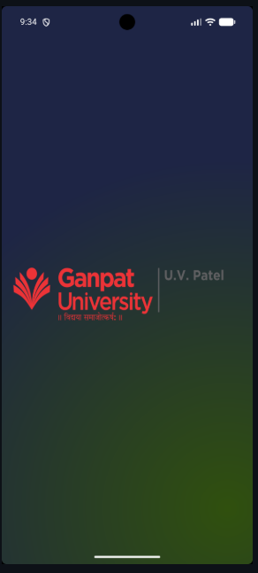
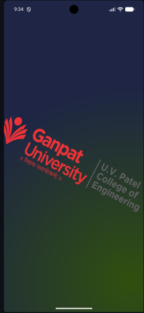
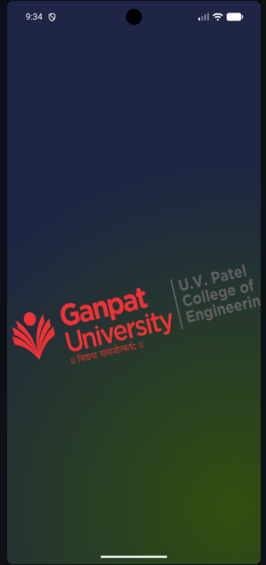
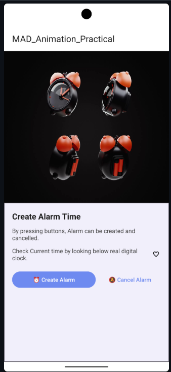
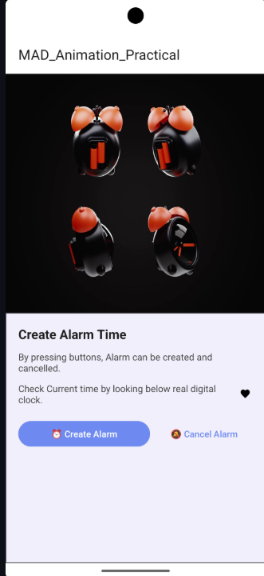

# Practical-6: Frame by Frame Animation & Twin Animation

## 🎯 Aim

Create an Android Application to demonstrate **Frame by Frame Animation** and **Twin Animation** using a Splash Screen and animated UI elements.

## 📖 About the Practical

This practical demonstrates two important Android animation techniques:

1. **Frame by Frame Animation (`AnimationDrawable`)** — displays a sequence of images one after another to create the effect of motion.
2. **Twin Animation (`Animation` / `AnimationUtils`)** — combines multiple animations such as translation, rotation, and scaling to create a single animation effect.

The application consists of two screens:

- **SplashActivity** — displays the Ganpat University / U.V. Patel College of Engineering logo with both frame-by-frame and twin animations.
- **MainActivity** — displays an animated alarm clock along with the main application interface.

## 🛠️ Concepts & Components Used

- `ImageView`
- `AnimationDrawable`
- `Animation`
- `AnimationUtils`
- `Animation.AnimationListener`
- `onWindowFocusChanged()`
- `<animation-list>`
- `<set>`
- `<translate>`
- `<rotate>`
- `<scale>`
- `ConstraintLayout`
- `MaterialCardView`
- `Intent`
- `enableEdgeToEdge()`
- `WindowInsetsCompat`
- `<gradient>` drawable

## 📱 Output

### 🎬 Demo Video

["D:\Demo video.mp4"
](https://github.com/user-attachments/assets/4dd9aa47-c65d-4115-a42e-d1c4ba10f70b)
### 🖼️ Screenshots

#### Splash Screen (Twin Animation + Frame by Frame)

| **Animation Start** | **Rotate + Scale Up** | **Animation End** |
|:---:|:---:|:---:|
|  |  |  |

#### Main Screen (Frame by Frame Animation)

| **Alarm Frame 1** | **Alarm Frame 2** |
|:---:|:---:|
|  |  |

## 📝 Conclusion

This practical demonstrates the implementation of **Frame by Frame Animation** and **Twin Animation** in an Android application. `AnimationDrawable` is used to display multiple images sequentially, while `AnimationUtils` is used to combine translation, rotation, and scaling effects.

The practical provides an understanding of how animations can be implemented to make Android applications more interactive and visually appealing.
